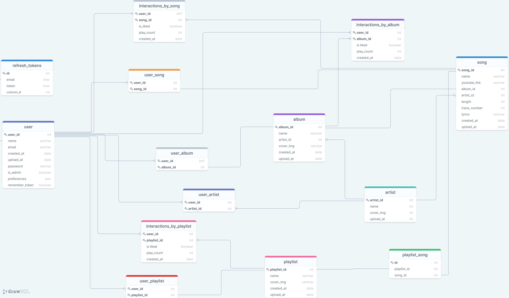

# My-Spotify-Application

## Info

`Type` - Full-Stack

`Framework` - React.js , Node.js

`Database` - MySQL

### Central Libraries :

- react-router-dom
- Material-UI
- framer-motion
- framer-motion
- Axios
- Express
- sequelize
- jsonwebtoken
- bcryptjs
- nodemailer
- nodemon
- joi

This app is a music service built into YouTube with a variety of playlists, albums, artists and songs 🎵 🎤

## Authentication

When we open the app, we will only have access to 3 routes which are the registration page, login and home page.


When attempting to submit the registration form, the data is validated only if it matches the cells (such as: e-mail was actually typed as an e-mail should look like) and has not yet been registered with the specified e-mail (the email is unique per user) then the user will receive a message to confirm to his e-mail, After approval, he will be taken to the login page and must order the username and password he filled out earlier.


## Home Page

When the connecting done, we redirect to the home page, the home page shows 4 carousels that show the "TOP20"
An example of Request for the TOP songs is here:

```js
router.get("/top_songs", async (req, res) => {
  const topSongs = await InteractionsBySong.findAll({
    attributes: [[sequelize.fn("SUM", sequelize.col("play_count")), "counterPlayer"]],
    include: [
      {
        model: Song,
        attributes: ["id", "name", "youtubeLink", "length", "lyrics"],
        include: [
          {
            model: Album,
            attributes: ["id", "name", "releasedAt", "coverImg"],
          },
          { model: Artist, attributes: ["id", "name"] },
        ],
      },
    ],
    order: [[sequelize.fn("SUM", sequelize.col("play_count")), "DESC"]],
    group: "song_id",
    limit: 20,
  });
  res.json(topSongs);
});
```

## Song Page

When we click on a particular song, we are taken to the page of a song, and the song starts playing, on the right is the list we came from, the URL joins QUERY which says what product we are coming from and what its number is, for example:

`http://localhost:3000/songs/45` **? playlists = 1**

`http://localhost:3000/songs/128` **?albums=19**

Below the song is information about the song, album, artist, name, etc ...
You can also like the song and it will be saved as your favorite song

Another feature is "AUTO PLAY", by default the songs play automatically, if you cancel this option and you press the SWITCH recorded in COCKIE that you cancel the option and the songs will no longer play automatically.


## Artist Page

An artist page, showing all the songs and albums of that artist, can be Subscribe to the artist.
Each album or song will lead us to the same product.
If we click on a song from the artist's page, we will get all the songs that were presented to the artist in the list of songs.


## Playlist Page & Album Page

Look the same and work similarly, each at the top has information about the product at the bottom get the songs list of the product.
Playlist can contain multiple artists, an album contains one artist and you can access the artist page from the album page.


## Searching

For the search I used Material-UI's Autocomplete.
to get the result I have an API:

`//http://localhost:8070/api/search?keyWord=avi`

That receives Query `keyWord`, the request goes out with each VALUE change of the INPUT, and returns an array of objects
with all the names that match the search. The check I did is if the string I typed appears somewhere in the name of one of the products. The check checks all the names of the songs, artists, playlists and albums and returns one array.

```js
router.get("/", async (req, res) => {
  const { keyWord } = req.query;
  const options = {
    attributes: ["name"],
    where: {
      name: {
        [Op.substring]: keyWord,
      },
    },
  };
  const matchedResults = await Promise.all([
    Artist.findAll(options),
    Album.findAll(options),
    Song.findAll(options),
    Playlist.findAll(options),
  ]);
  res.json(matchedResults.flat());
});
```


## ERD SQL


